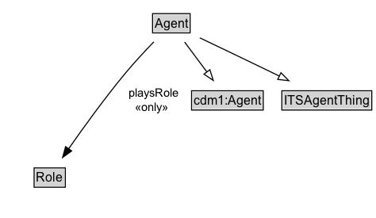

# Agent

## Diagram

=== "SVG (interactive)"

    <!-- Generated by graphviz version 14.0.2 (20251019.1705)
     -->
    <!-- Pages: 1 -->
    <svg width="356pt" height="206pt"
     viewBox="0.00 0.00 356.00 206.00" xmlns="http://www.w3.org/2000/svg" xmlns:xlink="http://www.w3.org/1999/xlink">
    <g id="graph0" class="graph" transform="scale(1 1) rotate(0) translate(4 202)">
    <polygon fill="white" stroke="none" points="-4,4 -4,-202 351.5,-202 351.5,4 -4,4"/>
    <g id="clust2" class="cluster">
    <title>cluster_associated</title>
    </g>
    <!-- Agent -->
    <g id="node1" class="node">
    <title>Agent</title>
    <g id="a_node1"><a xlink:href="../Agent" xlink:title="&lt;TABLE&gt;">
    <polygon fill="lightgray" stroke="none" points="141.25,-171.88 141.25,-188.12 174.75,-188.12 174.75,-171.88 141.25,-171.88"/>
    <text xml:space="preserve" text-anchor="start" x="142.25" y="-175.72" font-family="Arial" font-size="12.00">Agent</text>
    <polygon fill="none" stroke="black" points="140.25,-170.88 140.25,-189.12 175.75,-189.12 175.75,-170.88 140.25,-170.88"/>
    </a>
    </g>
    </g>
    <!-- Invis -->
    <!-- Agent&#45;&gt;Invis -->
    <!-- Role -->
    <g id="node3" class="node">
    <title>Role</title>
    <g id="a_node3"><a xlink:href="../Role" xlink:title="&lt;TABLE&gt;">
    <polygon fill="lightgray" stroke="none" points="29.25,-25.88 29.25,-42.12 56.75,-42.12 56.75,-25.88 29.25,-25.88"/>
    <text xml:space="preserve" text-anchor="start" x="30.25" y="-29.73" font-family="Arial" font-size="12.00">Role</text>
    <polygon fill="none" stroke="black" points="28.25,-24.88 28.25,-43.12 57.75,-43.12 57.75,-24.88 28.25,-24.88"/>
    </a>
    </g>
    </g>
    <!-- Agent&#45;&gt;Role -->
    <g id="edge5" class="edge">
    <title>Agent&#45;&gt;Role</title>
    <path fill="none" stroke="black" d="M141.47,-162.41C133.18,-153.86 123.16,-143.12 114.75,-133 95.27,-109.55 74.91,-81.33 60.87,-61.21"/>
    <polygon fill="black" stroke="black" points="63.77,-59.24 55.2,-53.01 58.01,-63.22 63.77,-59.24"/>
    <text xml:space="preserve" text-anchor="middle" x="141.38" y="-110.05" font-family="Arial" font-size="11.00"> playsRole </text>
    <text xml:space="preserve" text-anchor="middle" x="141.38" y="-96.55" font-family="Arial" font-size="11.00"> «only» &#160;</text>
    </g>
    <!-- cdm1_Agent -->
    <g id="node4" class="node">
    <title>cdm1_Agent</title>
    <g id="a_node4"><a xlink:href="https://w3id.org/citydata/part1/v1/Agent" xlink:title="&lt;TABLE&gt;">
    <polygon fill="lightgray" stroke="none" points="178.12,-98.88 178.12,-115.12 243.88,-115.12 243.88,-98.88 178.12,-98.88"/>
    <text xml:space="preserve" text-anchor="start" x="179.12" y="-102.72" font-family="Arial" font-size="12.00">cdm1:Agent</text>
    <polygon fill="none" stroke="black" points="177.12,-97.88 177.12,-116.12 244.88,-116.12 244.88,-97.88 177.12,-97.88"/>
    </a>
    </g>
    </g>
    <!-- Agent&#45;&gt;cdm1_Agent -->
    <g id="edge1" class="edge">
    <title>Agent&#45;&gt;cdm1_Agent</title>
    <path fill="none" stroke="black" d="M170.56,-162.17C176.9,-153.69 184.72,-143.21 191.79,-133.73"/>
    <polygon fill="none" stroke="black" points="194.45,-136.03 197.62,-125.92 188.84,-131.84 194.45,-136.03"/>
    </g>
    <!-- ITSAgentThing -->
    <g id="node5" class="node">
    <title>ITSAgentThing</title>
    <g id="a_node5"><a xlink:href="../ITSAgentThing" xlink:title="&lt;TABLE&gt;">
    <polygon fill="lightgray" stroke="none" points="263.5,-98.88 263.5,-115.12 346.5,-115.12 346.5,-98.88 263.5,-98.88"/>
    <text xml:space="preserve" text-anchor="start" x="264.5" y="-102.72" font-family="Arial" font-size="12.00">ITSAgentThing</text>
    <polygon fill="none" stroke="black" points="262.5,-97.88 262.5,-116.12 347.5,-116.12 347.5,-97.88 262.5,-97.88"/>
    </a>
    </g>
    </g>
    <!-- Agent&#45;&gt;ITSAgentThing -->
    <g id="edge2" class="edge">
    <title>Agent&#45;&gt;ITSAgentThing</title>
    <path fill="none" stroke="black" d="M184.93,-166.18C204.19,-156.98 230.72,-144.28 254,-133 256.08,-131.99 258.21,-130.96 260.35,-129.91"/>
    <polygon fill="none" stroke="black" points="261.64,-133.18 269.09,-125.65 258.57,-126.89 261.64,-133.18"/>
    </g>
    <!-- Invis&#45;&gt;Role -->
    </g>
    </svg>

=== "PNG"

    

## Formalization for Agent

| Property | Constraint |
|----------|------------|
| [playsRole](https://w3id.org/itsdata/agent/v1/playsRole) | only [Role](Role.md) |
| subClassOf | [ITSAgentThing](ITSAgentThing.md) |
| subClassOf | [cdm1:Agent](https://w3id.org/citydata/part1/v1/Agent) |

