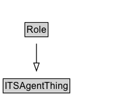

# Role

## Diagram

=== "SVG (interactive)"

    <!-- Generated by graphviz version 14.0.2 (20251019.1705)
     -->
    <!-- Pages: 1 -->
    <svg width="166pt" height="132pt"
     viewBox="0.00 0.00 166.00 132.00" xmlns="http://www.w3.org/2000/svg" xmlns:xlink="http://www.w3.org/1999/xlink">
    <g id="graph0" class="graph" transform="scale(1 1) rotate(0) translate(4 128)">
    <polygon fill="white" stroke="none" points="-4,4 -4,-128 161.5,-128 161.5,4 -4,4"/>
    <g id="clust2" class="cluster">
    <title>cluster_associated</title>
    </g>
    <!-- Role -->
    <g id="node1" class="node">
    <title>Role</title>
    <g id="a_node1"><a xlink:href="../Role" xlink:title="&lt;TABLE&gt;">
    <polygon fill="lightgray" stroke="none" points="28.75,-81.88 28.75,-98.12 56.25,-98.12 56.25,-81.88 28.75,-81.88"/>
    <text xml:space="preserve" text-anchor="start" x="29.75" y="-85.72" font-family="Arial" font-size="12.00">Role</text>
    <polygon fill="none" stroke="black" points="27.75,-80.88 27.75,-99.12 57.25,-99.12 57.25,-80.88 27.75,-80.88"/>
    </a>
    </g>
    </g>
    <!-- ITSAgentThing -->
    <g id="node3" class="node">
    <title>ITSAgentThing</title>
    <g id="a_node3"><a xlink:href="../ITSAgentThing" xlink:title="&lt;TABLE&gt;">
    <polygon fill="lightgray" stroke="none" points="1,-9.88 1,-26.12 84,-26.12 84,-9.88 1,-9.88"/>
    <text xml:space="preserve" text-anchor="start" x="2" y="-13.72" font-family="Arial" font-size="12.00">ITSAgentThing</text>
    <polygon fill="none" stroke="black" points="0,-8.88 0,-27.12 85,-27.12 85,-8.88 0,-8.88"/>
    </a>
    </g>
    </g>
    <!-- Role&#45;&gt;ITSAgentThing -->
    <g id="edge1" class="edge">
    <title>Role&#45;&gt;ITSAgentThing</title>
    <path fill="none" stroke="black" d="M42.5,-72.05C42.5,-64.57 42.5,-55.58 42.5,-47.14"/>
    <polygon fill="none" stroke="black" points="46,-47.3 42.5,-37.3 39,-47.3 46,-47.3"/>
    </g>
    <!-- Invis -->
    </g>
    </svg>

=== "PNG"

    

## Formalization for Role

| Property | Constraint |
|----------|------------|
| [cdm1:hasName](https://w3id.org/citydata/part1/v1/hasName) | exactly 1 |
| subClassOf | [ITSAgentThing](ITSAgentThing.md) |

## Used by classes

| Class | Property |
|-------|----------|
| [Agent](Agent.md) | [playsRole](https://w3id.org/itsdata/agent/v1/playsRole) |

